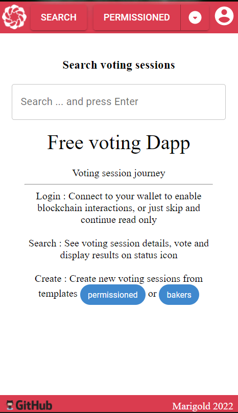
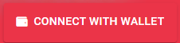
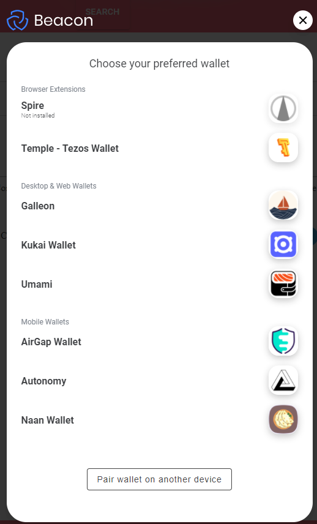
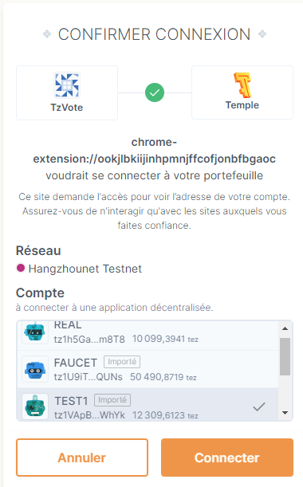
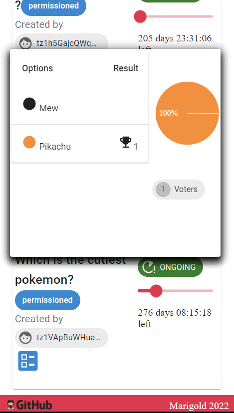
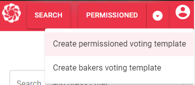
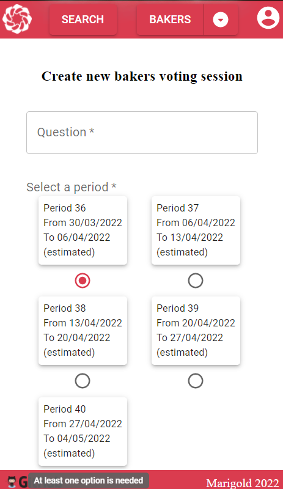
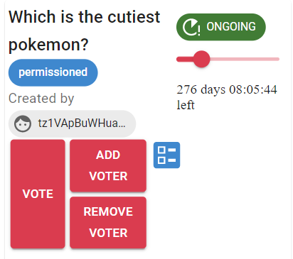

# TzVote

[logo]: https://i.imgflip.com/r56sp.jpg?a456398 "Vote"

TzVote is a dapp for voting purpose composed by :
- a React application with Taquito SDK
- a voting session smart contract template in jsligo
- a cronjob pushing data to the oracle smart contract

# Play with the application

The app is available on all networks :
 - [MAINNET](https://tzvote.marigold.dev/)
 - [HANGZHOUNET](https://hangzhounet.tzvote.marigold.dev/)
 - [ITHACANET](https://ithacanet.tzvote.marigold.dev/) 

## Connect to your wallet

Click on the header button

Select your wallet

Select your account

## Search

You can search existing polls and click on the status of a particular one to see the results

## Create

On the header, you can choose which template you want to use and click on the button to display the form

Fill the form and click on the CREATE button

If you have connected your wallet, you will be able to deploy a voting session Smart Contract on Tezos

## Vote

Vote button only appears (depending of the choosen template policies) if you are :
- logged in
- authorized to vote
- have not yet voted

# Cronjob

Push current Tezos voting period index to the Oracle storage

