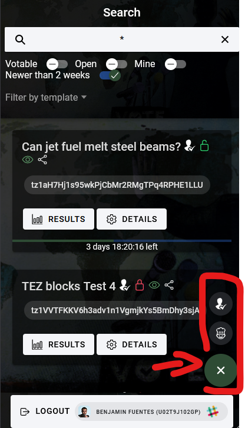
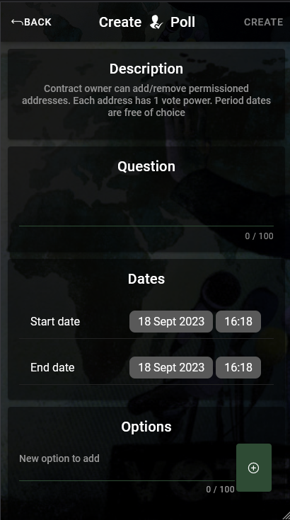
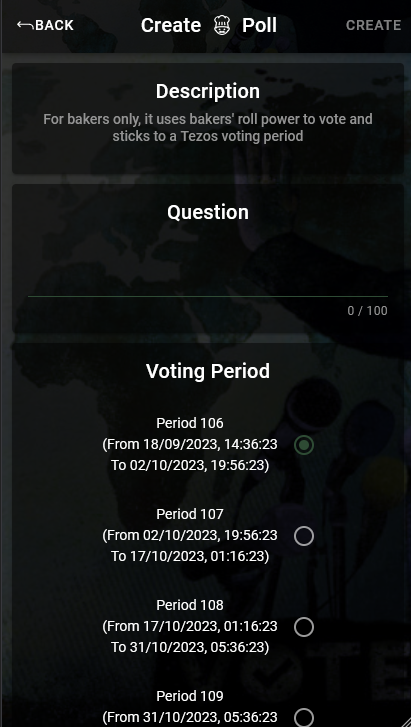

# Create a poll

Click on the bottom-right floating button to display the voting templates

## Create a permissioned poll

Permissioned poll creates a poll with allowed voters. Only the creator of the poll can choose who can vote

1. Add a question
1. Add dates from and to
1. Add at minimum 1 option
1. Add voters :

- individual voter : add an address, one by one
- bakers delegatees : add all baker delegatees from a baker address
- Import CSV file : add all addresses from the CSV (comma separated, only 1 column)
- add my delegatees (baker only) : import all my delegatees

Once all fields are filled, you can click on top-right **CREATE** button

## Create a baker poll

Anyone can create a baker poll but only bakers will be allowed to vote on it. For the final result, ballot weight is relative to baker's total stake

1. Add a question
1. Select a Tezos voting period. Your poll will stick to it, so the end date is an estimation
1. Add at minimum 1 option

Once all fields are filled, you can click on top-right **CREATE** button

> You don't need to specified bakers addresses, it is automatically filtered by the smart contract in case voter is not a baker
