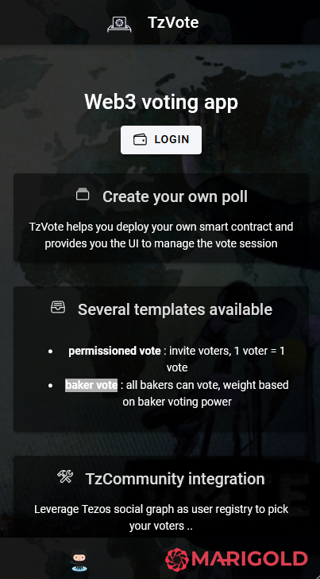
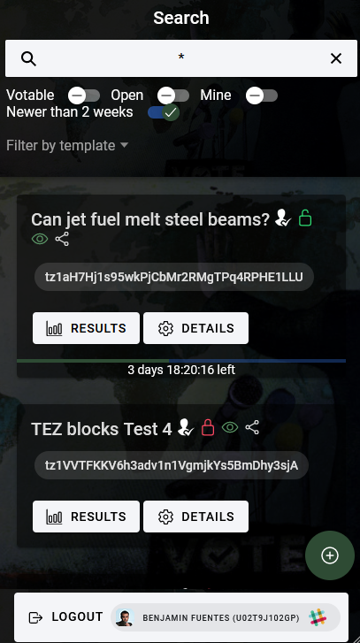

# Login

On the Home page you have a login button

Click on it

Select your preferred wallet, your account

> A second popup will ask you to sign a payload, once done you will be logged on TzCommunity backend and all Tezos addresses will be resolve to human-readable social account aliases (only if you have the right to see it)

> If you have linked your social account on [TzCommunity](https://tezos-community.com), your profile will appear on the Logout bottom button and everywhere else on the application. I recommend you to link your account with your tz1 address to make it more friendly, it is totally free and more UX friendly.

## Logout

Click on the bottom button **LOGOUT**
