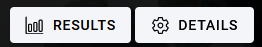
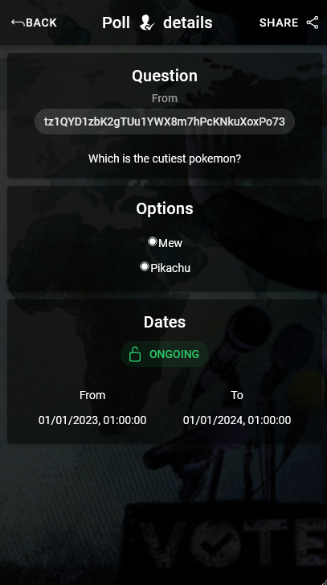
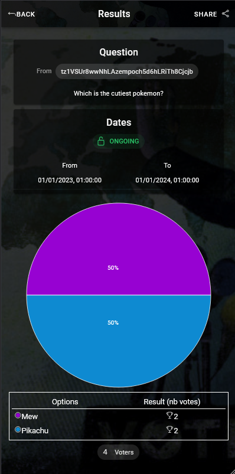

# Manage a poll

Each poll has a dedicated page / url for management

## Details

You can see here the details of the poll, and you can vote (it is the right time)

> You can also [share the poll](./SHARE.md) (top-right button)

> If you are the creator of the poll, you can also manage some settings, like adding or removing voters for example

## Results

