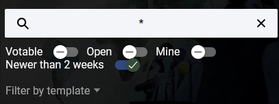
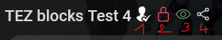

# Search

## Filters

Use top filter to faster search

- Votable : filter only votable polls
- Open : filter only open polls. It means that voting time is active. On the contrary, polls in the future or with end date passed are locked
- Mine : filter only poll where I am the creator
- Filter by template : by template type, baker or permissioned

## Icons

1. template type : baker or permissioned
1. status : locked or ongoing
1. tzkt link : see the poll on an indexer
1. share button : shortcut to share the poll with someone
